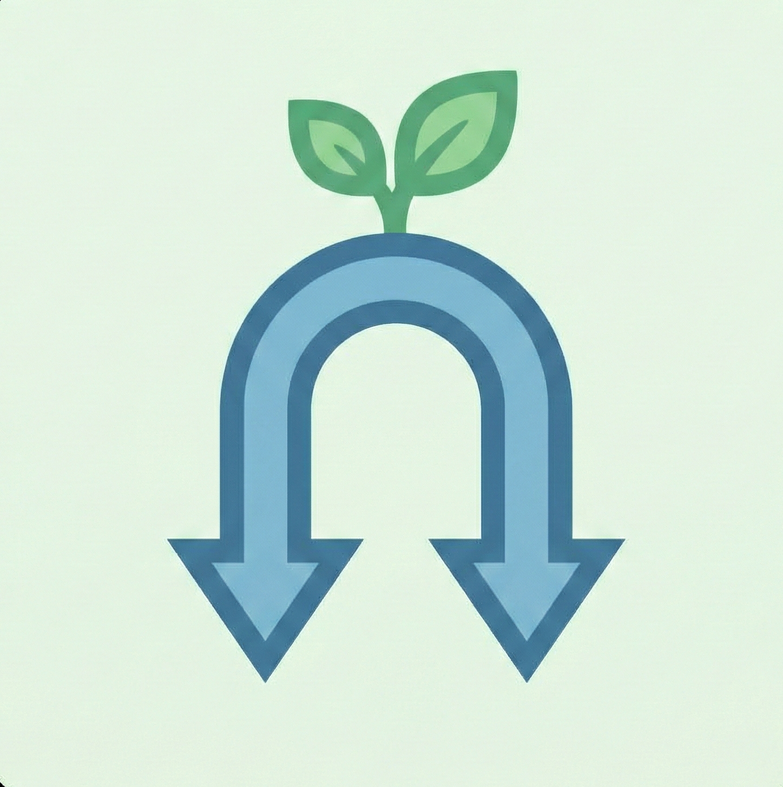

# Pre-Seederr 🚀



A lightweight, fully containerized web application written in Go that automates "Reverse Cross-Seeding." 

If you want to build buffer on a hard-economy private tracker (Tracker A) by grabbing the exact same release from an easy-economy tracker (Tracker B), this tool automates the entire process.

## ✨ Features
* **Zero-Touch Injection:** Simultaneously injects Tracker B's active download and Tracker A's paused `.torrent` file directly into qBittorrent.
* **Prowlarr Integration:** Automatically searches your configured indexers for exact file size matches.
* **Fuzzy Matching:** Configurable size tolerance (e.g., +/- 5MB) to account for missing `.nfo` files between trackers.
* **Incredibly Lightweight:** Compiled Go binary running in Alpine Linux. Uses <20MB of RAM.
* **Unraid / Docker Ready:** Designed to be run as a 24/7 background container alongside your existing ARRs.

## 📦 Installation (Docker)

The easiest way to run Pre-Seeder is via Docker. A pre-built image is available on the GitHub Container Registry.

```bash
docker run -d \
  --name pre-seeder \
  --restart unless-stopped \
  -p 5000:5000 \
  -v /path/to/your/appdata/preseeder/data:/app/data \
  ghcr.io/YOUR_GITHUB_USERNAME/pre-seeder:latest
  
  ```
  (Note: Replace /path/to/your/appdata/preseeder/data with your actual Docker appdata path to ensure your settings survive container restarts).

## ⚙️ Configuration
Open http://localhost:5000 (or your server's IP) in your browser.

Navigate to the Settings tab.

Enter your Prowlarr URL and API Key.

Enter your qBittorrent URL, credentials, and the default save path for pre-seeds.

## 🛠️ Usage
Download a .torrent file from your target hard-economy tracker (Tracker A).

Upload it to the Pre-Seeder web interface.

The app will query Prowlarr and display matching releases from your other trackers based on the exact file size.

Click Inject Both to qBit.

Tracker B will begin downloading to your save path. Tracker A will be added in a Paused state pointing to the exact same path.

Once Tracker B hits 100%, right-click Tracker A in qBittorrent, hit Force Recheck, and resume!
  